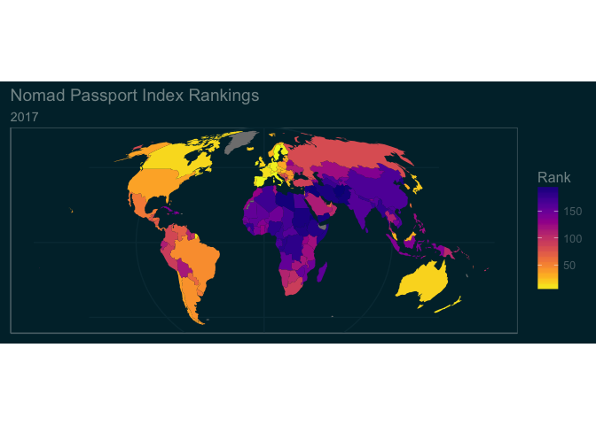

```{r setup, include=FALSE}
knitr::opts_chunk$set(echo = TRUE)
```



> The [Nomad Passport Index](http://nomadcapitalist.com/nomad-passport-index/) The Nomad Passport Index ranks 199 citizenships on five factors, more than any other passport index. It is designed to show the best citizenships in the world to hold on the basis of visa-free travel, international taxation, perception, dual citizenship, and personal freedom.

The PDF report has a table of the rankings, I thought it would be nice to illustrate how to extract data from a PDF, since I have never tried it, and visualise the data since they are only presented in tabular format. In this document I will show you how to extract data from a PDF and convert it into a data frame, use various [`tidyverse`](http://tidyverse.org) packages to clean up, organise and merge the data, download and import geographic data using the [`rnaturalearth`](https://github.com/ropenscilabs/rnaturalearth) and join the data using [`dplyr`](https://cran.rstudio.com/web/packages/dplyr/vignettes/introduction.html)for plotting using [`ggplot2`](http://ggplot2.org) including a map (see above), a scatter plot and some violin plots of the data. I hope that you find this useful.

## Working with PDFs

To work with the PDF and extract the data, first we need the [`pdftools`](https://github.com/ropensci/pdftools) package from ROpenSci. This allows us to extract the text from the PDF and work with it. Getting started, install the `pdftools` package, if it is not already installed.

```{r, eval=FALSE}
install.packages("pdftools", dep = TRUE)
```
Next download the PDF report using `download.file()`.

```{r download_pdf, eval = FALSE}
download.file("https://s3-eu-west-1.amazonaws.com/nomadcapitalist/Nomad-Passport-Index-2017.pdf", mode = "wb", destfile = "~/Downloads/Nomad-Passport-Index-2017.pdf")
```
### Import the PDF data

Import the PDF using `pdf_text()` from `pdftools`.
```{r import_pdf}
library(pdftools)
NPI <- pdf_text("~/Downloads/Nomad-Passport-Index-2017.pdf")
```

The PDF data are arranged nicely in tabular format in the PDF but not for R. `pdf_text()` does a nice job of pulling the data out and it is pretty close to what we need but we end up with a character string with several elements.

```{r view_NPI_text}
NPI
```

### First attempts at organising the PDF data
Note that the table starts with the fifth element and goes to the seventeenth. Let us try to convert all the elements into a tibble using `read_table()`.

```{r try_read_table_all, echo=FALSE}
library(readr)
NPI_table <- read_table(NPI[5:17], col_names = TRUE)
```

```{r NPI_table}
NPI_table
```

There should be more than 15 rows. There are 200 in the original data. `readr::read_table` isn't handling the elements properly. So we can try using `plyr::ldply()` to convert all into a `tibble`.

### Try using plyr to read the table

```{r ldply}
library(plyr)
NPI_table <- ldply(as.list(NPI[5:17]), read_table, col_names = FALSE)
```
Note that some of the messages indicate less columns for some elements than others? I've not shown the entire table in this document just for brevity, but have a look at `NPI_table` to see what's going on.

```{r NPI_table2}
NPI_table[60:65, ]
```

See line 63? St. Vincent and the Grenadines are split across two columns not one, this causes an extra ninth column to be added and things do not line up in the columns as they should.

### The Solution! Read the data in chunks

Note that the initial import shows that the data are indexed, e.g. `[1]...` and so on. We can use that and try parsing each element individually and then cleaning up the individual data frames to merge them.

For the first table, we won't use any column names and we'll skip the first line and assign names after everything is assembled.

```{r make_table, message=FALSE, warning=FALSE}
NPI_table1 <- read_table(NPI[5], col_names = FALSE, skip = 1)
NPI_table1

NPI_table2 <- read_table(NPI[6], col_names = FALSE)
NPI_table2

NPI_table3 <- read_table(NPI[7], col_names = FALSE)
NPI_table3

NPI_table4 <- read_table(NPI[8], col_names = FALSE)
NPI_table4

NPI_table5 <- read_table(NPI[9], col_names = FALSE)
NPI_table5

NPI_table6 <- read_table(NPI[10], col_names = FALSE)
NPI_table6

NPI_table7 <- read_table(NPI[11], col_names = FALSE)
NPI_table7

NPI_table8 <- read_table(NPI[12], col_names = FALSE)
NPI_table8

NPI_table9 <- read_table(NPI[13], col_names = FALSE)
NPI_table9

NPI_table10 <- read_table(NPI[14], col_names = FALSE)
NPI_table10

NPI_table11 <- read_table(NPI[15], col_names = FALSE)
NPI_table11

NPI_table12 <- read_table(NPI[16], col_names = FALSE)
NPI_table12

NPI_table13 <- read_table(NPI[17], col_names = FALSE)
NPI_table13

```

Now we can see that `NPI_tables 4`, `10` and `11` need some attention. First we will correct `NPI_table4` and `NPI_table11` by merging columns 2 and 3 on line 15 and then removing column 3 for `NPI_table4 and columns 2 and 3 on line 2 of `NPI_table11`.

```{r fix_NPI_table4}
NPI_table4[15, 2] <- paste(NPI_table4[15, 2], NPI_table4[15, 3], collapse = "")
NPI_table4 <- NPI_table4[, -3]

NPI_table11[2, 2] <- paste(NPI_table11[2, 2], NPI_table11[2, 3], collapse = "")
NPI_table11 <- NPI_table11[, -3]

# name columns to match other tables
names(NPI_table4) <- names(NPI_table11) <- names(NPI_table1)

```

Now we will fix `NPI_table10`. The "’" in Cote d’Ivoire is causing issues in parsing the text. Replace it with a "'" using `gsub()`.

```{r fix_NPI_table10}
NPI_table10[1, 2] <- gsub(pattern = "’", "'", NPI_table10[1, 2])
```

Using the `extract()` function from `tidyr` we will separate column 3 into the proper columns. Note the use of `[[:print:]]` in the last place of the `regexp`. This is because these numbers have decimals in them and the column has spaces if there are no decimals.

```{r extract_NPI_table10_cols}
library(tidyr)
NPI_table10 <-
  tidyr::extract(NPI_table10,
  X3,
  into = c("X1", "X2", "X3", "X4", "X5", "X6"),
  regex = "([[:alnum:]]+[[:space:]])([[:alnum:]]+[[:space:]])([[:alnum:]]+[[:space:]])([[:alnum:]]+[[:space:]])([[:alnum:]]+[[:space:]])([[:print:]]+)")

# name columns to match other tables
names(NPI_table10) <- names(NPI_table1)

# While we are here, note that Angola has a typo in the third column, it is 455 when it should be 55, fix that now.

NPI_table10[11, 3] <- 55

```

Now we can use `rbind` to join the tables together into one.

```{r rbind_tables}

NPI_table <- rbind(NPI_table1,
                   NPI_table2,
                   NPI_table3,
                   NPI_table4,
                   NPI_table5,
                   NPI_table6,
                   NPI_table7,
                   NPI_table8,
                   NPI_table9,
                   NPI_table10,
                   NPI_table11,
                   NPI_table12,
                   NPI_table13)

names(NPI_table) <- c("Rank", "Country", "VFT", "T", "P", "DC", "F", "Total")
```

There is still a (T) in the first column to indicate ties. Using `gsub()` remove this.

```{r remove_T}
NPI_table[[1]] <- gsub(pattern = "\\(T\\)", "", NPI_table[[1]])
```

Now let us set the type in the table. The first column, "Rank" and third through the eighth should be numeric. The second, "Country" is already character so no change is necessary.

```{r set_type}
NPI_table[, c(1, 3:8)] <- tibble::as_tibble(lapply(NPI_table[, c(1, 3:8)], as.numeric))
NPI_table
```

## Getting geographic data to help us visulalise these rankings

Now the data are completely ingested and cleaned up and we can start visualising them.

### Using `rnatualearth`
Using the ROpenSci package `rnaturalearth` we can map these data.

```{r, rnaturalearth}
# devtools::install_packages("ropensci/rnaturalearth")
library(rnaturalearth)
```

Get a global map of all countries.

```{r, global_map}
global <- ne_countries(scale = 110, type = "countries")
```
### Create a data frame that we can use more easily

We'll now convert the Natural Earth data to a data frame so that it can be joined with the passport index data. To do this we'll use `fortify()` from `ggplot2` and specify the region to be "name", which is the name of the country in the shapefile. We can then use this to join the data with other data, including data originally in the shapefile that's lost when fortifying.

```{r, fortify}
library(ggplot2)
global@data$id <- rownames(global@data)
global_df <- fortify(global, region = "name")
```

Since Antarctica doesn't have a passport, we can remove it and tidy up the final map. We'll subset the data removing anything below -60 Latitude. -60 will leave all the countries in the Southern hemisphere while removing Antarctica.

```{r, remove_antarctica}
global_df <- global_df[global_df$lat >= -60, ]
```
### Joining the rankings with the Natual Earth data

Use `dplyr::left_join` to join the data for mapping. First, join with the original data from the Natural Earth shapefile, and second with the Nomad Passport Index data.

```{r, join_data}
library(dplyr)
global_df <- left_join(global_df, global@data, c("id" = "name"))
```

In order to join the data, we need to change some of the country names so that the formats agree between the two data sets. Easily done by looking at the map to see which countries don't have data, but do exist in both data sets and make the corrections below. I've already looked at the map without making these changes and am not showing that step.

```{r, resetting_names}
global_df[global_df == "Bosnia and Herz."] <- "Bosnia and Herzegovina"
global_df[global_df == "Central African Rep."] <- "Central African Republic"
global_df[global_df == "Côte d'Ivoire"] <- "Cote d'Ivoire"
global_df[global_df == "Czech Rep."] <- "Czech Republic"
global_df[global_df == "Dem. Rep. Congo"] <- "Dem. Rep. of Congo"
global_df[global_df == "Congo"] <- "Republic of Congo"
global_df[global_df == "Dominican Rep."] <- "Dominican Republic"
global_df[global_df == "Eq. Guinea"] <- "Equatorial Guinea"
global_df[global_df == "Lao PDR"] <- "Laos"
global_df[global_df == "S. Sudan"] <- "South Sudan"
global_df[global_df == "Solomon Is."] <- "Solomon Islands"
global_df[global_df == "Dem. Rep. Korea"] <- "North Korea"
global_df[global_df == "Korea"] <- "South Korea"
```
```{r, join_NPI_table}
global_df <- left_join(global_df, NPI_table, c("id" = "Country"))
head(global_df)
```

All good, now we're ready to start visualising the data

## Visualising

### First a map
Now that the data are all assembled, we can start graphing and mapping. We'll use `ggplot2`, which we already loaded for the `fortify()` function to turn the original spatial object into a normal data frame.

Using the awesome [viridis](https://cran.r-project.org/web/packages/viridis/vignettes/intro-to-viridis.html) library to supply the colour scheme of the map and  [ggthemes](https://cran.r-project.org/web/packages/ggthemes/vignettes/ggthemes.html) for the plot theme let's map the passport index rank and use a Mollweide projection to make things look nice and keep Greenland from being too large.

```{r, plot}
library(viridis)
library(ggthemes)

ggplot(global_df, aes(long, lat)) +
  geom_polygon(aes(group = group, fill = Rank)) +
  scale_fill_viridis(option = "plasma", direction = -1) +
  theme_solarized(light = FALSE) +
  theme(axis.title = element_blank(),
      axis.text = element_blank(),
      axis.ticks = element_blank()) +
  ggtitle("Nomad Passport Index Rankings",
          subtitle = "2017") +
  coord_map(projection = "mollweide")
```

Lighter colours (smaller numbers) indicate a more desirable passport, darker colours (larger numbers) indicate less desirable.

### More graphs

Let's look at the NPI rank by continent starting with Africa. We'll subset the `global_df` data frame to create a new data frame that includes only data for Africa and make a point graph of that data.

```{r, graph_continent}
Africa_df <- global_df[global_df$continent == "Africa", ]

ggplot(Africa_df, aes(x = as.factor(id), y = Rank)) +
  geom_point(aes(colour = Rank)) +
  scale_color_viridis(option = "plasma", direction = -1) +
  theme_solarized(light = FALSE) +
  theme(axis.text.x = element_text(size = 7,
                                   angle = 45,
                                   hjust = 1)) +
  scale_y_continuous(limits = c(1, 200)) +
  xlab("Country") +
  ggtitle("Nomad Passport Index Rankings for African Countries",
          subtitle = "2017")


```

We can see the frequency of ranking by continent using a violin plot. Looking at the map above, Africa and Asia it looks like they have lower ranked passports in general than other continents.

```{r, violin_plots, message=FALSE, warning=FALSE}
# first remove the open ocean "continent" so it does not appear on the graph
global_df <- global_df[global_df$continent != "Seven seas (open ocean)", ]

ggplot(global_df, aes(x = as.factor(continent), y = Rank)) +
  geom_violin(colour = "#F1F650", fill = "#F1F650") +
  scale_fill_viridis(option = "plasma", direction = -1, discrete = TRUE) +
   theme_solarized(light = FALSE) +
    xlab("Continent")
```

As another way to look at the data, we can plot countries' rank by the income group. Here we'll use violin plots with points over the top.

```{r, economic_rank, message=FALSE, warning=FALSE}
ggplot(global_df, aes(x = income_grp, y = Rank)) +
  geom_violin(fill = "#666666", colour = "#666666") +
  geom_point(aes(colour = Rank)) +
  scale_color_viridis(option = "plasma", direction = -1) +
  theme_solarized(light = FALSE) +
  xlab("Income Group") +
  theme(axis.text.x = element_text(size = 8,
                                   angle = 45,
                                   hjust = 1))
```

## Wrap up

There are plenty of other ways to look at the data. The Natural Earth Data include GDP, economy and subregions and the Nomad Passport Index has several factors that go into the ranking that can be included as well. I hope that you've found this useful as an example of how to extract data and join it with geographic data and visualise it.

Thanks to the package maintainers for the fantastic packages that made this sort of work possible with R.

# References
Jeffrey B. Arnold (2017). ggthemes: Extra Themes, Scales and Geoms for 'ggplot2'. R package version 3.4.0.
  https://CRAN.R-project.org/package=ggthemes
Simon Garnier (2016). viridis: Default Color Maps from 'matplotlib'. R package version 0.3.4.
  https://CRAN.R-project.org/package=viridis
Jeroen Ooms (2016). pdftools: Text Extraction and Rendering of PDF Documents. R package version 1.0.
  https://CRAN.R-project.org/package=pdftools
H. Wickham. ggplot2: Elegant Graphics for Data Analysis. Springer-Verlag New York, 2009.
Hadley Wickham (2011). The Split-Apply-Combine Strategy for Data Analysis. Journal of Statistical Software, 40(1), 1-29.     URL http://www.jstatsoft.org/v40/i01/.
Hadley Wickham and Romain Francois (2016). dplyr: A Grammar of Data Manipulation. R package version 0.5.0.
  https://CRAN.R-project.org/package=dplyr
Hadley Wickham, Jim Hester and Romain Francois (2016). readr: Read Tabular Data. R package version 1.0.0.
  https://CRAN.R-project.org/package=readr
  
# R System Information

```{r system information, echo=FALSE}
sessionInfo()
