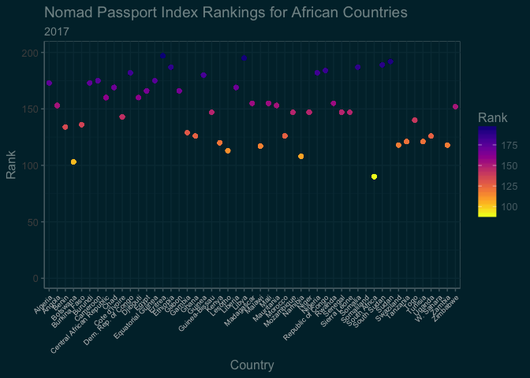
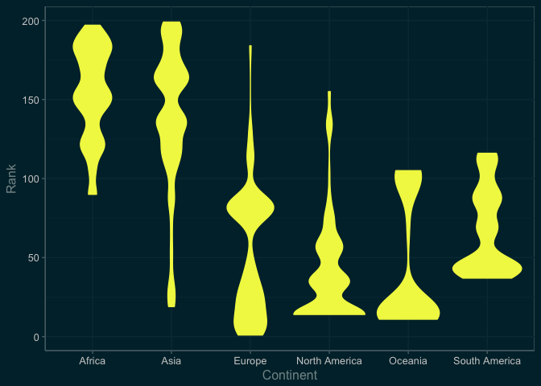
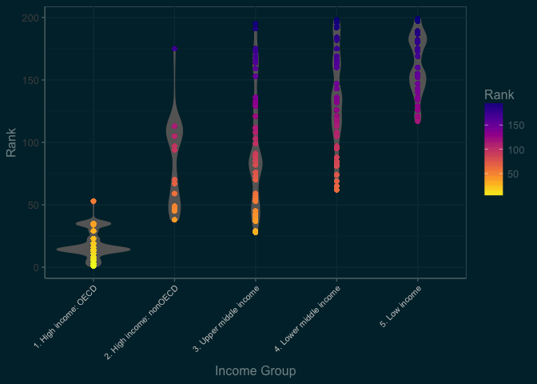

Visualising the World's Passports
================


> The [Nomad Passport Index](http://nomadcapitalist.com/nomad-passport-index/) The Nomad Passport Index ranks 199 citizenships on five factors, more than any other passport index. It is designed to show the best citizenships in the world to hold on the basis of visa-free travel, international taxation, perception, dual citizenship, and personal freedom.

The PDF report has a table of the rankings, I thought it would be nice to illustrate how to extract data from a PDF, since I have never tried it, and visualise the data since they are only presented in tabular format. In this document I will show you how to extract data from a PDF and convert it into a data frame, use various [`tidyverse`](http://tidyverse.org) packages to clean up, organise and merge the data, download and import geographic data using the [`rnaturalearth`](https://github.com/ropenscilabs/rnaturalearth) and join the data using [`dplyr`](https://cran.rstudio.com/web/packages/dplyr/vignettes/introduction.html)for plotting using [`ggplot2`](http://ggplot2.org) including a map (see above), a scatter plot and some violin plots of the data. I hope that you find this useful.

Working with PDFs
-----------------

To work with the PDF and extract the data, first we need the [`pdftools`](https://github.com/ropensci/pdftools) package from ROpenSci. This allows us to extract the text from the PDF and work with it. Getting started, install the `pdftools` package, if it is not already installed.

``` r
install.packages("pdftools", dep = TRUE)
```

Next download the PDF report using `download.file()`.

``` r
download.file("https://s3-eu-west-1.amazonaws.com/nomadcapitalist/Nomad-Passport-Index-2017.pdf", mode = "wb", destfile = "~/Downloads/Nomad-Passport-Index-2017.pdf")
```

### Import the PDF data

Import the PDF using `pdf_text()` from `pdftools`.

``` r
library(pdftools)
NPI <- pdf_text("~/Downloads/Nomad-Passport-Index-2017.pdf")
```

The PDF data are arranged nicely in tabular format in the PDF but not for R. `pdf_text()` does a nice job of pulling the data out and it is pretty close to what we need but we end up with a character string with several elements.

``` r
NPI
```

    ##  [1] ""                                                                                                                                                                                                                                                                                                                                                                                                                                                                                                                                                                                                                                                                                                                                                                                                                                                                                                                                                                                                                                                                                                                                                                                                                                                                                                                                                                                                                                                                                                                                                                                                                                                                                                                                                                                                                                                                                                                                                                                                                                                                                                                                                                                                                                                                                                                                                          
    ##  [2] "ABOUT THIS INDEX\nNomad Capitalist was founded by perpetual traveler, entrepreneur, and investor\nAndrew Henderson in 2012 to share his “notes from the field” about living, doing\nbusiness, and investing overseas. Since then, www.nomadcapitalist.com has\nbecome the most-visited website on the topic of international diversification,\nattracting more than three million unique visitors per year.\nNomad Capitalist assists six- and seven-figure entrepreneurs to legally reduce their\nbusiness and income taxes by relocating overseas, obtain residence permits and\ncitizenships in other countries for diversification, and invest in fast-growing\ninternational markets to grow their wealth faster.\nThe Nomad Passport Index was designed to educate global citizens about the true\nvalue of the world’s citizenships. While most indexes compare only a passport\nholder’s ability to travel freely, we realized that citizens of different countries deal\nwith far different requirements to pay tax, live freely, and avoid scrutiny when\ntraveling. This index is designed to show the true value of citizenship in each\ncountry from the perspective of a high-achieving citizen who wants the freedom to\nminimize his or her tax obligations, diversify his or her wealth, and travel freely\nwithout judgment.\nMETHODOLOGY\nThe Nomad Passport Index ranks the value of citizenship in and, by extension the\npassport of, 199 countries and territories in the world based on five factors:\n• Visa-free travel - 50% of ranking\n• Taxation - 20% of ranking\n• Perception - 10% of ranking\n• Dual citizenship - 10% of ranking\n• Overall freedom - 10% of ranking\nEach country’s value in each category is given the indicated weighting to achieve a\ncountry’s total score using the formula ((Visa Free Travel x 0.5) + (Taxation x 0.2)\n+ (Perception x 0.1) + (Dual Citizenship x 0.1) + (Overall Freedom x 0.1)).\n                             1 | www.nomadcapitalist.com\n"                                                                                                                                                                                                                                                                                                                               
    ##  [3] "The Index is the result of aggregating data from more than one dozen sources\nbased on priorities Nomad Capitalist believes to be important to citizens of a\ncountry and to individuals considering citizenship in a given country. For more\ninformation, watch this video.\nVISA-FREE TRAVEL\nThe most important factor in the value of a passport is the travel opportunities it\naffords. The Nomad Passport Index places the highest priority on visa-free travel,\nwhich is responsible for 50% of each country’s total ranking. This index relied on\ndata from the IATA, the Henley Visa Restrictions Index, and news sources to\ndetermine each country’s score, which is the number of countries that allow visa-\nfree access or a straightforward e-visa or visa on arrival process to holders of each\ncountry’s passport. For example, Germany scores highest with 177 countries.\nTAXATION\nThe second most important factor in the value of a passport is tax freedom, which\nis responsible for 30% of each country’s total ranking. We believe that no one\nshould be forced to pay tax by virtue of their citizenship alone. This index relied on\ndata from our personal experience with clients, our network of tax advisors around\nthe world, and each country’s tax agency or embassy, to determine how non-\nresident citizens are taxed. Each country was assigned a score from 10 to 50; for\nexample, the United States and Eritrea scored lowest with 10, while Monaco and\nothers scored highest with 50:\n• 10 = citizens are taxed on their worldwide income no matter where they lived\n• 20 = citizens may avoid taxation by moving overseas, but with difficulty\n• 30 = citizens may avoid taxation by moving overseas, without much difficulty\n• 40 = citizens are not taxed on foreign source income no matter where they live\n• 50 = citizens are not taxed on any income no matter where they live\nPERCEPTION\nThe world’s perception of a country and its citizens are responsible for 10% of\neach country’s total ranking. Each country’s passport is as valuable as it is able to\nbe used freely and keep its holders safe. This index relied on the World Happiness\nReport, the Human Development Index, and subjective factors based on our\n                            2 | www.nomadcapitalist.com\n"
    ##  [4] "personal experience with clients to determine how each country and its citizens are\nreceived. Each country was assigned a score from 10 to 50. A ranking if 10 was\ngiven to countries whose citizens are refused entry to a substantial number of\ncountries and/or whose citizens encounter substantial hostility. A ranking of 50 was\ngiven to countries ranked among the happiest in the world and whose citizens\nexperience minimal hostility. Rankings of 20, 30, and 40 were given as\nintermediate rankings.\nDUAL CITIZENSHIP\nThe ability to maintain other citizenships alongside that of the ranked country is\nresponsible for 10% of each country’s total ranking. We believe that everyone\nshould be free to hold dual or multiple citizenships without restriction. This index\nrelied on data from each country’s embassy when available, various internet\nsources when not available, and our personal experiences with our global network,\nto determine how free citizens of each country are to hold other nationalities. Each\ncountry was assigned a score from 10 to 50:\n• 10 = citizens are strictly forbidden to hold other citizenships\n• 20 = citizens are forbidden to hold other citizenships, but this is often unenforced\n• 30 = citizens may hold only one other citizenship and/or other restrictions\n• 40 = citizens are often allowed to hold other citizenships\n• 50 = citizens are almost always allowed to hold other citizenships\nFREEDOM\nThe ability of citizens to live freely is responsible for 10% of each country’s total\nranking. We believe that freedom of speech and of the press is a good thing, and\nimposing laws on non-resident citizens is generally a bad idea. This index relied on\ndata regarding mandatory military service, government spying programs,\nincarceration rate, and laws targeting non-resident citizens (such as the United\nStates’ Foreign Corrupt Practices Act), as well as the World Press Freedom Index\nand Economic Freedom Index to determine how free citizens of each country are,\nparticularly non-resident citizens. Each country was assigned a score from 10 to 50\nbased on our proprietary blend of these factors, with 10 being the least free and 50\nbeing the most free.\n                              3 | www.nomadcapitalist.com\n"     
    ##  [5] "Rank  Country     VFT   T  P DC   F Total\n1     Sweden       176 30 50  50 50   109\n2     Belgium      174 30 50  50 50   108\n3(T)  Italy        175 30 40  50 50 107.5\n3(T)  Spain        175 30 40  50 50 107.5\n5     Ireland      172 30 50  50 50   107\n6(T)  Finland      175 20 50  50 50 106.5\n6(T)  Germany      177 30 40  40 40 106.5\n8(T)  Denmark      174 30 50  40 40   106\n8(T)  Switzerland  172 30 50  50 40   106\n8(T)  Luxembourg   172 30 40  50 50   106\n11(T) France       175 30 40  50 30 105.5\n11(T) New Zealand  171 30 50  50 40 105.5\n13    Portugal     172 30 30  50 50   105\n14(T) Canada       172 20 50  50 40   104\n14(T) Netherlands  174 30 50  10 50   104\n"                                                                                                                                                                                                                                                                                                                                                                                                                                                                                                                                                                                                                                                                                                                                                                                                                                                                                                                                                                                                                                                                                                                                                                                                                                                                                                                                                                                                                                                                                                                                                                                                                                          
    ##  [6] "16(T) United Kingdom 175 20 40 50 30 103.5\n16(T) Australia      169 20 50 50 50 103.5\n18    Malta          168 30 30 50 50   103\n19(T) Japan          173 30 40 10 50 102.5\n19(T) Singapore      173 40 40 10 30 102.5\n19(T) Czech Republic 167 30 30 50 50 102.5\n19(T) Iceland        167 30 30 50 50 102.5\n23(T) Austria        173 30 40 10 40 101.5\n23(T) Greece         171 20 30 50 40 101.5\n23(T) Hungary        167 30 30 50 40 101.5\n23(T) Slovakia       165 30 30 50 50 101.5\n27    Liechtenstein  164 30 30 50 50   101\n28    Latvia         163 30 30 50 50 100.5\n29(T) South Korea    172 30 40 10 30   100\n29(T) Norway         172 20 50 10 40   100\n29(T) Malaysia       164 40 30 20 50   100\n"                                                                                                                                                                                                                                                                                                                                                                                                                                                                                                                                                                                                                                                                                                                                                                                                                                                                                                                                                                                                                                                                                                                                                                                                                                                                                                                                                                                                                                                                                                                                                                                                                          
    ##  [7] "29(T) Estonia       162 30 30 50 50  100\n29(T) Monaco        160 50 40 10 50  100\n34    Poland        161 30 30 50 50 99.5\n35(T) United States 174 10 20 40 30   98\n35(T) Slovenia      164 30 30 20 50   98\n37    Chile         155 30 40 50 50 97.5\n38(T) Cyprus        159 30 30 50 30 96.5\n38(T) Bulgaria      153 30 40 50 50 96.5\n40(T) Hong Kong     154 40 40 20 50   96\n40(T) Lithuania     162 30 30 10 50   96\n42    Romania       153 30 30 50 50 95.5\n43(T) San Marino    156 30 30 10 50   93\n43(T) Argentina     152 30 30 50 30   93\n45(T) Brazil        153 20 40 50 30 92.5\n45(T) Brunei        151 50 20 10 40 92.5\n47(T) Andorra       152 30 30 20 50   92\n"                                                                                                                                                                                                                                                                                                                                                                                                                                                                                                                                                                                                                                                                                                                                                                                                                                                                                                                                                                                                                                                                                                                                                                                                                                                                                                                                                                                                                                                                                                                                                                                                                                                          
    ##  [8] "47(T) Bahamas                        140 50 30 40 50   92\n49    Croatia                        149 20 30 50 50 91.5\n50(T) Holy See                       134 50 40 20 50   88\n50(T) St. Kitts and Nevis            132 50 30 40 50   88\n52    Barbados                       141 30 30 50 30 87.5\n53(T) Israel                         147 20 10 50 30 86.5\n53(T) Uruguay                        137 30 30 40 50 86.5\n55    Mexico                         139 30 40 30 30 85.5\n56    Seychelles                     133 40 30 20 50 84.5\n57    Costa Rica                     131 40 30 20 50 83.5\n58    Antigua and Barbuda            134 20 30 30 50   82\n59(T) Taiwan                         137 30 30 20 20 81.5\n59(T) Panama                         127 40 30 20 50 81.5\n59(T) St. Lucia                      125 30 30 50 50 81.5\n62(T) St. Vincent and the Grenadines 125 30 30 30 50 79.5\n62(T) Honduras                       119 40 30 40 50 79.5\n"                                                                                                                                                                                                                                                                                                                                                                                                                                                                                                                                                                                                                                                                                                                                                                                                                                                                                                                                                                                                                                                                                                                                                                                                                                                                                                                                                                          
    ##  [9] "64    Mauritius            128 30 30 10 50   79\n65(T) Paraguay             125 30 30 50 20 78.5\n65(T) Dominica             119 30 30 50 50 78.5\n67    Trinidad and Tobago  130 20 30 10 50   78\n68    Grenada              121 20 30 50 50 77.5\n69    Vanuatu              110 50 30 40 50   77\n70(T) Venezuela            132 20 30 20 10   76\n70(T) United Arab Emirates 122 50 30 10 10   76\n72    Macao                120 30 30 10 50   75\n73    Serbia               115 30 30 40 40 74.5\n74(T) Guatemala            116 40 30 20 20   73\n74(T) Nicaragua            110 40 30 20 50   73\n76(T) Macedonia            111 30 30 40 40 72.5\n76(T) Montenegro           107 30 30 50 50 72.5\n78    Samoa                112 30 30 10 50   71\n79    Tonga                110 30 30 10 50   70\n"                                                                                                                                                                                                                                                                                                                                                                                                                                                                                                                                                                                                                                                                                                                                                                                                                                                                                                                                                                                                                                                                                                                                                                                                                                                                                                                                                                                                                                                                                                                                          
    ## [10] "80    Palau                  104 40 30 10 50   69\n81    El Salvador            115 20 30 20 20 68.5\n82    Russia                 105 30 20 30 20 65.5\n83(T) Albania                 98 30 30 40 30   65\n83(T) Georgia                 94 40 30 30 40   65\n85(T) Colombia               103 20 30 40 20 64.5\n85(T) Bosnia and Herzegovina 101 30 20 30 30 64.5\n85(T) Moldova                101 30 30 30 20 64.5\n88(T) Turkey                 102 30 20 40 10   64\n88(T) Belize                  94 40 30 30 30   64\n90    South Africa            97 30 30 30 10 61.5\n91(T) Peru                    86 30 30 40 40   60\n91(T) Tuvalu                  82 40 30 30 50   60\n93    Nauru                   80 40 30 30 50   59\n94    Kuwait                  82 50 30 10 30   58\n95    Solomon Islands         86 30 30 10 40   57\n"                                                                                                                                                                                                                                                                                                                                                                                                                                                                                                                                                                                                                                                                                                                                                                                                                                                                                                                                                                                                                                                                                                                                                                                                                                                                                                                                                                                                                                                                                                          
    ## [11] "96     Marshall Islands 79 40 30 10 50 56.5\n97(T)  Fiji             81 30 30 30 30 55.5\n97(T)  Qatar            79 50 30 10 20 55.5\n99(T)  Maldives         80 40 30 10 30   55\n99(T)  Suriname         74 30 30 50 40   55\n101    Kiribati         79 30 30 10 50 54.5\n102    Micronesia       75 40 30 10 40 53.5\n103(T) Jamaica          78 20 30 30 40   53\n103(T) Botswana         72 40 30 10 50   53\n105(T) Papua New Guinea 77 30 30 20 30 52.5\n105(T) Bahrain          73 50 30 10 20 52.5\n105(T) Oman             71 50 30 10 30 52.5\n108(T) Guyana           82 20 30 10 30   52\n108(T) Timor-Leste      82 20 30 10 30   52\n108(T) Namibia          70 40 30 20 40   52\n111    Thailand         71 40 30 30 20 51.5\n"                                                                                                                                                                                                                                                                                                                                                                                                                                                                                                                                                                                                                                                                                                                                                                                                                                                                                                                                                                                                                                                                                                                                                                                                                                                                                                                                                                                                                                                                                                                                                                                                          
    ## [12] "112    Ecuador      81 20 30 10 20 50.5\n113(T) Ukraine      81 20 20 20 10 49.5\n113(T) Lesotho      69 40 30 10 30 49.5\n113(T) Saudi Arabia 69 50 30 10 10 49.5\n116    Bolivia      72 20 30 40 20   49\n117    Malawi       67 40 30 10 30 48.5\n118(T) Swaziland    67 30 30 40 10 47.5\n118(T) Zambia       63 40 30 30 20 47.5\n120    Kenya        68 20 30 30 20   46\n121(T) Kazakhstan   67 30 30 10 20 45.5\n121(T) Tanzania     65 20 30 20 30 44.5\n121(T) Tunisia      65 20 30 30 20 44.5\n121(T) Cape Verde   61 30 30 30 20 44.5\n121(T) Philippines  61 40 30 20 10 44.5\n126(T) Ghana        64 20 30 20 30   44\n126(T) Uganda       60 30 30 30 20   44\n"                                                                                                                                                                                                                                                                                                                                                                                                                                                                                                                                                                                                                                                                                                                                                                                                                                                                                                                                                                                                                                                                                                                                                                                                                                                                                                                                                                                                                                                                                                                                                                                                                                                                          
    ## [13] "126(T) Morocco            60 30 30 30 20   44\n129(T) Belarus            67 30 20 10 10 43.5\n129(T) Gambia             67 20 20 20 20 43.5\n131    Dominican Republic 54 30 30 40 30   43\n132    Armenia            57 30 30 30 20 42.5\n133    Azerbaijan         62 30 30 10 10   42\n134    Benin              60 20 30 20 20   41\n135    Bhutan             51 40 30 10 30 40.5\n136(T) Cuba               60 30 20 10 10   40\n136(T) Indonesia          58 30 30 10 10   40\n136(T) Burkina Faso       56 20 30 20 30   40\n136(T) Mongolia           56 30 30 10 20   40\n140(T) Togo               55 20 30 20 30 39.5\n140(T) Tajikistan         53 30 30 30 10 39.5\n140(T) Comoros            47 30 20 40 40 39.5\n143(T) Kyrgyzstan         58 20 30 10 20   39\n"                                                                                                                                                                                                                                                                                                                                                                                                                                                                                                                                                                                                                                                                                                                                                                                                                                                                                                                                                                                                                                                                                                                                                                                                                                                                                                                                                                                                                                                                                                                                                                          
    ## [14] "143(T) Cote d’Ivoire          56 20 20 30 20   39\n143(T) Sao Tome and Principe  54 20 30 20 30   39\n143(T) Cambodia               50 30 30 30 20   39\n147(T) Niger                  55 20 30 10 30 38.5\n147(T) Senegal                55 20 30 20 20 38.5\n147(T) Guinea-Bissau          51 20 30 50 10 38.5\n147(T) Mozambique             51 30 30 20 20 38.5\n147(T) Sierra Leone           51 30 20 20 30 38.5\n152    Zimbabwe               60 20 20 10 10   38\n153(T) Mauritania             55 20 30 10 20 37.5\n153(T) Angola                455 40 30 20 20 37.5\n155(T) Mali                   52 20 30 30 10   37\n155(T) Haiti                  48 20 20 30 40   37\n155(T) Madagascar             48 30 30 10 30   37\n155(T) Rwanda                 48 30 30 20 20   37\n159    Jordan                 47 30 30 20 20 36.5\n"                                                                                                                                                                                                                                                                                                                                                                                                                                                                                                                                                                                                                                                                                                                                                                                                                                                                                                                                                                                                                                                                                                                                                                                                                                                                                                                                                                                                                                                                                                          
    ## [15] "160(T) India                    52 20 30 10 20   36\n160(T) Central African Republic 48 20 30 30 20   36\n160(T) Djibouti                 44 40 30 20 10   36\n163    Vietnam                  47 30 30 20 10 35.5\n164(T) Uzbekistan               52 20 30 10 10   35\n164(T) China                    50 20 30 10 20   35\n166(T) Egypt                    49 20 20 30 10 34.5\n166(T) Gabon                    49 20 20 20 20 34.5\n166(T) Sri Lanka                39 30 30 40 20 34.5\n169(T) Chad                     49 20 20 10 20 33.5\n169(T) Laos                     47 30 20 10 10 33.5\n169(T) Liberia                  43 30 20 10 30 33.5\n169(T) Lebanon                  39 40 20 10 30 33.5\n173(T) Algeria                  48 20 20 20 10   33\n173(T) Burundi                  42 20 20 30 20   32\n175(T) Turkmenistan             49 20 10 10 10 31.5\n"                                                                                                                                                                                                                                                                                                                                                                                                                                                                                                                                                                                                                                                                                                                                                                                                                                                                                                                                                                                                                                                                                                                                                                                                                                                                                                                                                                                                                                                                          
    ## [16] "175(T) Cameroon              45 20 20 10 20 31.5\n175(T) Equatorial Guinea     45 20 20 20 10 31.5\n175(T) Bangladesh            39 30 30 10 20 31.5\n175(T) Nepal                 37 30 30 10 30 31.5\n180(T) Myanmar               42 30 20 10 10   31\n180(T) Guinea                46 20 20 10 10   31\n182(T) Nigeria               45 20 10 20 10 30.5\n182(T) Dem. Rep. of Congo    39 40 10 10 10 30.5\n184(T) Republic of Congo     44 20 20 10 10   30\n184(T) Kosovo                38 20 20 20 30   30\n186    Palestinian Territory 37 30 10 20 20 29.5\n187(T) Ethiopia              37 20 30 10 20 28.5\n187(T) Somalia               31 50 10 10 10 28.5\n189(T) North Korea           42 20 10 10 10   28\n189(T) South Sudan           38 20 10 20 20   28\n191    Iran                  37 30 10 10 10 27.5\n"                                                                                                                                                                                                                                                                                                                                                                                                                                                                                                                                                                                                                                                                                                                                                                                                                                                                                                                                                                                                                                                                                                                                                                                                                                                                                                                                                                                                                                                                                                                          
    ## [17] "192    Sudan       37 20 10 20 10 26.5\n193(T) Yemen       38 20 10 10 10   26\n193(T) Syria       32 30 10 20 10   26\n195    Libya       36 20 10 10 10   25\n196    Pakistan    29 20 20 20 20 24.5\n197    Eritrea     37 10 10 10 10 23.5\n198    Iraq        30 20 10 20 10   23\n199    Afghanistan 25 20 10 10 20 20.5\n"

### First attempts at organising the PDF data

Note that the table starts with the fifth element and goes to the seventeenth. Let us try to convert all the elements into a tibble using `read_table()`.

    ## Warning in if (grepl("\n", file)) {: the condition has length > 1 and only
    ## the first element will be used

    ## Warning in if (grepl("\n", file)) {: the condition has length > 1 and only
    ## the first element will be used

    ## Warning in if (grepl("\n", file)) {: the condition has length > 1 and only
    ## the first element will be used

    ## Warning in if (grepl("\n", file)) {: the condition has length > 1 and only
    ## the first element will be used

``` r
NPI_table
```

    ## # A tibble: 15 × 8
    ##     Rank     Country   VFT     T     P    DC     F Total
    ##    <chr>       <chr> <int> <int> <int> <int> <int> <dbl>
    ## 1      1      Sweden   176    30    50    50    50 109.0
    ## 2      2     Belgium   174    30    50    50    50 108.0
    ## 3   3(T)       Italy   175    30    40    50    50 107.5
    ## 4   3(T)       Spain   175    30    40    50    50 107.5
    ## 5      5     Ireland   172    30    50    50    50 107.0
    ## 6   6(T)     Finland   175    20    50    50    50 106.5
    ## 7   6(T)     Germany   177    30    40    40    40 106.5
    ## 8   8(T)     Denmark   174    30    50    40    40 106.0
    ## 9   8(T) Switzerland   172    30    50    50    40 106.0
    ## 10  8(T)  Luxembourg   172    30    40    50    50 106.0
    ## 11 11(T)      France   175    30    40    50    30 105.5
    ## 12 11(T) New Zealand   171    30    50    50    40 105.5
    ## 13    13    Portugal   172    30    30    50    50 105.0
    ## 14 14(T)      Canada   172    20    50    50    40 104.0
    ## 15 14(T) Netherlands   174    30    50    10    50 104.0

There should be more than 15 rows. There are 200 in the original data. `readr::read_table` isn't handling the elements properly. So we can try using `plyr::ldply()` to convert all into a `tibble`.

### Try using plyr to read the table

``` r
library(plyr)
NPI_table <- ldply(as.list(NPI[5:17]), read_table, col_names = FALSE)
```

Note that some of the messages indicate less columns for some elements than others? I've not shown the entire table in this document just for brevity, but have a look at `NPI_table` to see what's going on.

``` r
NPI_table[60:65, ]
```

    ##       X1                  X2         X3  X4 X5 X6 X7 X8   X9
    ## 60 59(T)              Taiwan            137 30 30 20 20 81.5
    ## 61 59(T)              Panama            127 40 30 20 50 81.5
    ## 62 59(T)           St. Lucia            125 30 30 50 50 81.5
    ## 63 62(T) St. Vincent and the Grenadines 125 30 30 30 50 79.5
    ## 64 62(T)            Honduras            119 40 30 40 50 79.5
    ## 65    64           Mauritius        128  30 30 10 50 79   NA

See line 63? St. Vincent and the Grenadines are split across two columns not one, this causes an extra ninth column to be added and things do not line up in the columns as they should.

### The Solution! Read the data in chunks

Note that the initial import shows that the data are indexed, e.g. `[1]...` and so on. We can use that and try parsing each element individually and then cleaning up the individual data frames to merge them.

For the first table, we won't use any column names and we'll skip the first line and assign names after everything is assembled.

``` r
NPI_table1 <- read_table(NPI[5], col_names = FALSE, skip = 1)
NPI_table1
```

    ## # A tibble: 15 × 8
    ##       X1          X2    X3    X4    X5    X6    X7    X8
    ##    <chr>       <chr> <int> <int> <int> <int> <int> <dbl>
    ## 1      1      Sweden   176    30    50    50    50 109.0
    ## 2      2     Belgium   174    30    50    50    50 108.0
    ## 3   3(T)       Italy   175    30    40    50    50 107.5
    ## 4   3(T)       Spain   175    30    40    50    50 107.5
    ## 5      5     Ireland   172    30    50    50    50 107.0
    ## 6   6(T)     Finland   175    20    50    50    50 106.5
    ## 7   6(T)     Germany   177    30    40    40    40 106.5
    ## 8   8(T)     Denmark   174    30    50    40    40 106.0
    ## 9   8(T) Switzerland   172    30    50    50    40 106.0
    ## 10  8(T)  Luxembourg   172    30    40    50    50 106.0
    ## 11 11(T)      France   175    30    40    50    30 105.5
    ## 12 11(T) New Zealand   171    30    50    50    40 105.5
    ## 13    13    Portugal   172    30    30    50    50 105.0
    ## 14 14(T)      Canada   172    20    50    50    40 104.0
    ## 15 14(T) Netherlands   174    30    50    10    50 104.0

``` r
NPI_table2 <- read_table(NPI[6], col_names = FALSE)
NPI_table2
```

    ## # A tibble: 16 × 8
    ##       X1             X2    X3    X4    X5    X6    X7    X8
    ##    <chr>          <chr> <int> <int> <int> <int> <int> <dbl>
    ## 1  16(T) United Kingdom   175    20    40    50    30 103.5
    ## 2  16(T)      Australia   169    20    50    50    50 103.5
    ## 3     18          Malta   168    30    30    50    50 103.0
    ## 4  19(T)          Japan   173    30    40    10    50 102.5
    ## 5  19(T)      Singapore   173    40    40    10    30 102.5
    ## 6  19(T) Czech Republic   167    30    30    50    50 102.5
    ## 7  19(T)        Iceland   167    30    30    50    50 102.5
    ## 8  23(T)        Austria   173    30    40    10    40 101.5
    ## 9  23(T)         Greece   171    20    30    50    40 101.5
    ## 10 23(T)        Hungary   167    30    30    50    40 101.5
    ## 11 23(T)       Slovakia   165    30    30    50    50 101.5
    ## 12    27  Liechtenstein   164    30    30    50    50 101.0
    ## 13    28         Latvia   163    30    30    50    50 100.5
    ## 14 29(T)    South Korea   172    30    40    10    30 100.0
    ## 15 29(T)         Norway   172    20    50    10    40 100.0
    ## 16 29(T)       Malaysia   164    40    30    20    50 100.0

``` r
NPI_table3 <- read_table(NPI[7], col_names = FALSE)
NPI_table3
```

    ## # A tibble: 16 × 8
    ##       X1            X2    X3    X4    X5    X6    X7    X8
    ##    <chr>         <chr> <int> <int> <int> <int> <int> <dbl>
    ## 1  29(T)       Estonia   162    30    30    50    50 100.0
    ## 2  29(T)        Monaco   160    50    40    10    50 100.0
    ## 3     34        Poland   161    30    30    50    50  99.5
    ## 4  35(T) United States   174    10    20    40    30  98.0
    ## 5  35(T)      Slovenia   164    30    30    20    50  98.0
    ## 6     37         Chile   155    30    40    50    50  97.5
    ## 7  38(T)        Cyprus   159    30    30    50    30  96.5
    ## 8  38(T)      Bulgaria   153    30    40    50    50  96.5
    ## 9  40(T)     Hong Kong   154    40    40    20    50  96.0
    ## 10 40(T)     Lithuania   162    30    30    10    50  96.0
    ## 11    42       Romania   153    30    30    50    50  95.5
    ## 12 43(T)    San Marino   156    30    30    10    50  93.0
    ## 13 43(T)     Argentina   152    30    30    50    30  93.0
    ## 14 45(T)        Brazil   153    20    40    50    30  92.5
    ## 15 45(T)        Brunei   151    50    20    10    40  92.5
    ## 16 47(T)       Andorra   152    30    30    20    50  92.0

``` r
NPI_table4 <- read_table(NPI[8], col_names = FALSE)
NPI_table4
```

    ## # A tibble: 16 × 9
    ##       X1                  X2         X3    X4    X5    X6    X7    X8
    ##    <chr>               <chr>      <chr> <int> <int> <int> <int> <int>
    ## 1  47(T)             Bahamas              140    50    30    40    50
    ## 2     49             Croatia              149    20    30    50    50
    ## 3  50(T)            Holy See              134    50    40    20    50
    ## 4  50(T) St. Kitts and Nevis              132    50    30    40    50
    ## 5     52            Barbados              141    30    30    50    30
    ## 6  53(T)              Israel              147    20    10    50    30
    ## 7  53(T)             Uruguay              137    30    30    40    50
    ## 8     55              Mexico              139    30    40    30    30
    ## 9     56          Seychelles              133    40    30    20    50
    ## 10    57          Costa Rica              131    40    30    20    50
    ## 11    58 Antigua and Barbuda              134    20    30    30    50
    ## 12 59(T)              Taiwan              137    30    30    20    20
    ## 13 59(T)              Panama              127    40    30    20    50
    ## 14 59(T)           St. Lucia              125    30    30    50    50
    ## 15 62(T) St. Vincent and the Grenadines   125    30    30    30    50
    ## 16 62(T)            Honduras              119    40    30    40    50
    ## # ... with 1 more variables: X9 <dbl>

``` r
NPI_table5 <- read_table(NPI[9], col_names = FALSE)
NPI_table5
```

    ## # A tibble: 16 × 8
    ##       X1                   X2    X3    X4    X5    X6    X7    X8
    ##    <chr>                <chr> <int> <int> <int> <int> <int> <dbl>
    ## 1     64            Mauritius   128    30    30    10    50  79.0
    ## 2  65(T)             Paraguay   125    30    30    50    20  78.5
    ## 3  65(T)             Dominica   119    30    30    50    50  78.5
    ## 4     67  Trinidad and Tobago   130    20    30    10    50  78.0
    ## 5     68              Grenada   121    20    30    50    50  77.5
    ## 6     69              Vanuatu   110    50    30    40    50  77.0
    ## 7  70(T)            Venezuela   132    20    30    20    10  76.0
    ## 8  70(T) United Arab Emirates   122    50    30    10    10  76.0
    ## 9     72                Macao   120    30    30    10    50  75.0
    ## 10    73               Serbia   115    30    30    40    40  74.5
    ## 11 74(T)            Guatemala   116    40    30    20    20  73.0
    ## 12 74(T)            Nicaragua   110    40    30    20    50  73.0
    ## 13 76(T)            Macedonia   111    30    30    40    40  72.5
    ## 14 76(T)           Montenegro   107    30    30    50    50  72.5
    ## 15    78                Samoa   112    30    30    10    50  71.0
    ## 16    79                Tonga   110    30    30    10    50  70.0

``` r
NPI_table6 <- read_table(NPI[10], col_names = FALSE)
NPI_table6
```

    ## # A tibble: 16 × 8
    ##       X1                     X2    X3    X4    X5    X6    X7    X8
    ##    <chr>                  <chr> <int> <int> <int> <int> <int> <dbl>
    ## 1     80                  Palau   104    40    30    10    50  69.0
    ## 2     81            El Salvador   115    20    30    20    20  68.5
    ## 3     82                 Russia   105    30    20    30    20  65.5
    ## 4  83(T)                Albania    98    30    30    40    30  65.0
    ## 5  83(T)                Georgia    94    40    30    30    40  65.0
    ## 6  85(T)               Colombia   103    20    30    40    20  64.5
    ## 7  85(T) Bosnia and Herzegovina   101    30    20    30    30  64.5
    ## 8  85(T)                Moldova   101    30    30    30    20  64.5
    ## 9  88(T)                 Turkey   102    30    20    40    10  64.0
    ## 10 88(T)                 Belize    94    40    30    30    30  64.0
    ## 11    90           South Africa    97    30    30    30    10  61.5
    ## 12 91(T)                   Peru    86    30    30    40    40  60.0
    ## 13 91(T)                 Tuvalu    82    40    30    30    50  60.0
    ## 14    93                  Nauru    80    40    30    30    50  59.0
    ## 15    94                 Kuwait    82    50    30    10    30  58.0
    ## 16    95        Solomon Islands    86    30    30    10    40  57.0

``` r
NPI_table7 <- read_table(NPI[11], col_names = FALSE)
NPI_table7
```

    ## # A tibble: 16 × 8
    ##        X1               X2    X3    X4    X5    X6    X7    X8
    ##     <chr>            <chr> <int> <int> <int> <int> <int> <dbl>
    ## 1      96 Marshall Islands    79    40    30    10    50  56.5
    ## 2   97(T)             Fiji    81    30    30    30    30  55.5
    ## 3   97(T)            Qatar    79    50    30    10    20  55.5
    ## 4   99(T)         Maldives    80    40    30    10    30  55.0
    ## 5   99(T)         Suriname    74    30    30    50    40  55.0
    ## 6     101         Kiribati    79    30    30    10    50  54.5
    ## 7     102       Micronesia    75    40    30    10    40  53.5
    ## 8  103(T)          Jamaica    78    20    30    30    40  53.0
    ## 9  103(T)         Botswana    72    40    30    10    50  53.0
    ## 10 105(T) Papua New Guinea    77    30    30    20    30  52.5
    ## 11 105(T)          Bahrain    73    50    30    10    20  52.5
    ## 12 105(T)             Oman    71    50    30    10    30  52.5
    ## 13 108(T)           Guyana    82    20    30    10    30  52.0
    ## 14 108(T)      Timor-Leste    82    20    30    10    30  52.0
    ## 15 108(T)          Namibia    70    40    30    20    40  52.0
    ## 16    111         Thailand    71    40    30    30    20  51.5

``` r
NPI_table8 <- read_table(NPI[12], col_names = FALSE)
NPI_table8
```

    ## # A tibble: 16 × 8
    ##        X1           X2    X3    X4    X5    X6    X7    X8
    ##     <chr>        <chr> <int> <int> <int> <int> <int> <dbl>
    ## 1     112      Ecuador    81    20    30    10    20  50.5
    ## 2  113(T)      Ukraine    81    20    20    20    10  49.5
    ## 3  113(T)      Lesotho    69    40    30    10    30  49.5
    ## 4  113(T) Saudi Arabia    69    50    30    10    10  49.5
    ## 5     116      Bolivia    72    20    30    40    20  49.0
    ## 6     117       Malawi    67    40    30    10    30  48.5
    ## 7  118(T)    Swaziland    67    30    30    40    10  47.5
    ## 8  118(T)       Zambia    63    40    30    30    20  47.5
    ## 9     120        Kenya    68    20    30    30    20  46.0
    ## 10 121(T)   Kazakhstan    67    30    30    10    20  45.5
    ## 11 121(T)     Tanzania    65    20    30    20    30  44.5
    ## 12 121(T)      Tunisia    65    20    30    30    20  44.5
    ## 13 121(T)   Cape Verde    61    30    30    30    20  44.5
    ## 14 121(T)  Philippines    61    40    30    20    10  44.5
    ## 15 126(T)        Ghana    64    20    30    20    30  44.0
    ## 16 126(T)       Uganda    60    30    30    30    20  44.0

``` r
NPI_table9 <- read_table(NPI[13], col_names = FALSE)
NPI_table9
```

    ## # A tibble: 16 × 8
    ##        X1                 X2    X3    X4    X5    X6    X7    X8
    ##     <chr>              <chr> <int> <int> <int> <int> <int> <dbl>
    ## 1  126(T)            Morocco    60    30    30    30    20  44.0
    ## 2  129(T)            Belarus    67    30    20    10    10  43.5
    ## 3  129(T)             Gambia    67    20    20    20    20  43.5
    ## 4     131 Dominican Republic    54    30    30    40    30  43.0
    ## 5     132            Armenia    57    30    30    30    20  42.5
    ## 6     133         Azerbaijan    62    30    30    10    10  42.0
    ## 7     134              Benin    60    20    30    20    20  41.0
    ## 8     135             Bhutan    51    40    30    10    30  40.5
    ## 9  136(T)               Cuba    60    30    20    10    10  40.0
    ## 10 136(T)          Indonesia    58    30    30    10    10  40.0
    ## 11 136(T)       Burkina Faso    56    20    30    20    30  40.0
    ## 12 136(T)           Mongolia    56    30    30    10    20  40.0
    ## 13 140(T)               Togo    55    20    30    20    30  39.5
    ## 14 140(T)         Tajikistan    53    30    30    30    10  39.5
    ## 15 140(T)            Comoros    47    30    20    40    40  39.5
    ## 16 143(T)         Kyrgyzstan    58    20    30    10    20  39.0

``` r
NPI_table10 <- read_table(NPI[14], col_names = FALSE)
NPI_table10
```

    ## # A tibble: 16 × 3
    ##        X1                    X2                   X3
    ##     <chr>                 <chr>                <chr>
    ## 1  143(T)         Cote d’Ivoire  56 20 20 30 20   39
    ## 2  143(T) Sao Tome and Principe  54 20 30 20 30   39
    ## 3  143(T)              Cambodia  50 30 30 30 20   39
    ## 4  147(T)                 Niger  55 20 30 10 30 38.5
    ## 5  147(T)               Senegal  55 20 30 20 20 38.5
    ## 6  147(T)         Guinea-Bissau  51 20 30 50 10 38.5
    ## 7  147(T)            Mozambique  51 30 30 20 20 38.5
    ## 8  147(T)          Sierra Leone  51 30 20 20 30 38.5
    ## 9     152              Zimbabwe  60 20 20 10 10   38
    ## 10 153(T)            Mauritania  55 20 30 10 20 37.5
    ## 11 153(T)                Angola 455 40 30 20 20 37.5
    ## 12 155(T)                  Mali  52 20 30 30 10   37
    ## 13 155(T)                 Haiti  48 20 20 30 40   37
    ## 14 155(T)            Madagascar  48 30 30 10 30   37
    ## 15 155(T)                Rwanda  48 30 30 20 20   37
    ## 16    159                Jordan  47 30 30 20 20 36.5

``` r
NPI_table11 <- read_table(NPI[15], col_names = FALSE)
NPI_table11
```

    ## # A tibble: 16 × 9
    ##        X1              X2       X3    X4    X5    X6    X7    X8    X9
    ##     <chr>           <chr>    <chr> <int> <int> <int> <int> <int> <dbl>
    ## 1  160(T)           India             52    20    30    10    20  36.0
    ## 2  160(T) Central African Republic    48    20    30    30    20  36.0
    ## 3  160(T)        Djibouti             44    40    30    20    10  36.0
    ## 4     163         Vietnam             47    30    30    20    10  35.5
    ## 5  164(T)      Uzbekistan             52    20    30    10    10  35.0
    ## 6  164(T)           China             50    20    30    10    20  35.0
    ## 7  166(T)           Egypt             49    20    20    30    10  34.5
    ## 8  166(T)           Gabon             49    20    20    20    20  34.5
    ## 9  166(T)       Sri Lanka             39    30    30    40    20  34.5
    ## 10 169(T)            Chad             49    20    20    10    20  33.5
    ## 11 169(T)            Laos             47    30    20    10    10  33.5
    ## 12 169(T)         Liberia             43    30    20    10    30  33.5
    ## 13 169(T)         Lebanon             39    40    20    10    30  33.5
    ## 14 173(T)         Algeria             48    20    20    20    10  33.0
    ## 15 173(T)         Burundi             42    20    20    30    20  32.0
    ## 16 175(T)    Turkmenistan             49    20    10    10    10  31.5

``` r
NPI_table12 <- read_table(NPI[16], col_names = FALSE)
NPI_table12
```

    ## # A tibble: 16 × 8
    ##        X1                    X2    X3    X4    X5    X6    X7    X8
    ##     <chr>                 <chr> <int> <int> <int> <int> <int> <dbl>
    ## 1  175(T)              Cameroon    45    20    20    10    20  31.5
    ## 2  175(T)     Equatorial Guinea    45    20    20    20    10  31.5
    ## 3  175(T)            Bangladesh    39    30    30    10    20  31.5
    ## 4  175(T)                 Nepal    37    30    30    10    30  31.5
    ## 5  180(T)               Myanmar    42    30    20    10    10  31.0
    ## 6  180(T)                Guinea    46    20    20    10    10  31.0
    ## 7  182(T)               Nigeria    45    20    10    20    10  30.5
    ## 8  182(T)    Dem. Rep. of Congo    39    40    10    10    10  30.5
    ## 9  184(T)     Republic of Congo    44    20    20    10    10  30.0
    ## 10 184(T)                Kosovo    38    20    20    20    30  30.0
    ## 11    186 Palestinian Territory    37    30    10    20    20  29.5
    ## 12 187(T)              Ethiopia    37    20    30    10    20  28.5
    ## 13 187(T)               Somalia    31    50    10    10    10  28.5
    ## 14 189(T)           North Korea    42    20    10    10    10  28.0
    ## 15 189(T)           South Sudan    38    20    10    20    20  28.0
    ## 16    191                  Iran    37    30    10    10    10  27.5

``` r
NPI_table13 <- read_table(NPI[17], col_names = FALSE)
NPI_table13
```

    ## # A tibble: 8 × 8
    ##       X1          X2    X3    X4    X5    X6    X7    X8
    ##    <chr>       <chr> <int> <int> <int> <int> <int> <dbl>
    ## 1    192       Sudan    37    20    10    20    10  26.5
    ## 2 193(T)       Yemen    38    20    10    10    10  26.0
    ## 3 193(T)       Syria    32    30    10    20    10  26.0
    ## 4    195       Libya    36    20    10    10    10  25.0
    ## 5    196    Pakistan    29    20    20    20    20  24.5
    ## 6    197     Eritrea    37    10    10    10    10  23.5
    ## 7    198        Iraq    30    20    10    20    10  23.0
    ## 8    199 Afghanistan    25    20    10    10    20  20.5

Now we can see that NPI\_tables 4, 10 and 11 need some attention. First we will correct `NPI_table4` and `NPI_table11` by merging columns 2 and 3 on line 15 and then removing column 3.

``` r
NPI_table4[15, 2] <- paste(NPI_table4[15, 2], NPI_table4[15, 3], collapse = "")
NPI_table4 <- NPI_table4[, -3]

NPI_table11[2, 2] <- paste(NPI_table11[2, 2], NPI_table11[2, 3], collapse = "")
NPI_table11 <- NPI_table11[, -3]

# name columns to match other tables
names(NPI_table4) <- names(NPI_table11) <- names(NPI_table1)
```

Now we will fix `NPI_table10`. The "’" in Cote d’Ivoire is causing issues in parsing the text. Replace it with a "'" using `gsub()`.

``` r
NPI_table10[1, 2] <- gsub(pattern = "’", "'", NPI_table10[1, 2])
```

Using the `extract()` function from `tidyr` we will separate column 3 into the proper columns. Note the use of `[[:print:]]` in the last place of the `regexp`. This is because these numbers have decimals in them and the column has spaces if there are no decimals.

``` r
library(tidyr)
NPI_table10 <-
  tidyr::extract(NPI_table10,
  X3,
  into = c("X1", "X2", "X3", "X4", "X5", "X6"),
  regex = "([[:alnum:]]+[[:space:]])([[:alnum:]]+[[:space:]])([[:alnum:]]+[[:space:]])([[:alnum:]]+[[:space:]])([[:alnum:]]+[[:space:]])([[:print:]]+)")

# name columns to match other tables
names(NPI_table10) <- names(NPI_table1)

# While we are here, note that Angola has a typo in the third column, it is 455 when it should be 55, fix that now.

NPI_table10[11, 3] <- 55
```

Now we can use `rbind` to join the tables together into one.

``` r
NPI_table <- rbind(NPI_table1,
                   NPI_table2,
                   NPI_table3,
                   NPI_table4,
                   NPI_table5,
                   NPI_table6,
                   NPI_table7,
                   NPI_table8,
                   NPI_table9,
                   NPI_table10,
                   NPI_table11,
                   NPI_table12,
                   NPI_table13)

names(NPI_table) <- c("Rank", "Country", "VFT", "T", "P", "DC", "F", "Total")
```

There is still a (T) in the first column to indicate ties. Using `gsub()` remove this.

``` r
NPI_table[[1]] <- gsub(pattern = "\\(T\\)", "", NPI_table[[1]])
```

Now let us set the type in the table. The first column, "Rank" and third through the eighth should be numeric. The second, "Country" is already character so no change is necessary.

``` r
NPI_table[, c(1, 3:8)] <- tibble::as_tibble(lapply(NPI_table[, c(1, 3:8)], as.numeric))
NPI_table
```

    ## # A tibble: 199 × 8
    ##     Rank     Country   VFT     T     P    DC     F Total
    ## *  <dbl>       <chr> <dbl> <dbl> <dbl> <dbl> <dbl> <dbl>
    ## 1      1      Sweden   176    30    50    50    50 109.0
    ## 2      2     Belgium   174    30    50    50    50 108.0
    ## 3      3       Italy   175    30    40    50    50 107.5
    ## 4      3       Spain   175    30    40    50    50 107.5
    ## 5      5     Ireland   172    30    50    50    50 107.0
    ## 6      6     Finland   175    20    50    50    50 106.5
    ## 7      6     Germany   177    30    40    40    40 106.5
    ## 8      8     Denmark   174    30    50    40    40 106.0
    ## 9      8 Switzerland   172    30    50    50    40 106.0
    ## 10     8  Luxembourg   172    30    40    50    50 106.0
    ## # ... with 189 more rows

Getting geographic data to help us visulalise these rankings
------------------------------------------------------------

Now the data are completely ingested and cleaned up and we can start visualising them.

### Using `rnatualearth`

Using the ROpenSci package `rnaturalearth` we can map these data.

``` r
# devtools::install_packages("ropensci/rnaturalearth")
library(rnaturalearth)
```

Get a global map of all countries.

``` r
global <- ne_countries(scale = 110, type = "countries")
```

### Create a data frame that we can use more easily

We'll now convert the Natural Earth data to a data frame so that it can be joined with the passport index data. To do this we'll use `fortify()` from `ggplot2` and specify the region to be "name", which is the name of the country in the shapefile. We can then use this to join the data with other data, including data originally in the shapefile that's lost when fortifying.

``` r
library(ggplot2)
global@data$id <- rownames(global@data)
global_df <- fortify(global, region = "name")
```

Since Antarctica doesn't have a passport, we can remove it and tidy up the final map. We'll subset the data removing anything below -60 Latitude. -60 will leave all the countries in the Southern hemisphere while removing Antarctica.

``` r
global_df <- global_df[global_df$lat >= -60, ]
```

### Joining the rankings with the Natual Earth data

Use `dplyr::left_join` to join the data for mapping. First, join with the original data from the Natural Earth shapefile, and second with the Nomad Passport Index data.

``` r
library(dplyr)
```

    ## 
    ## Attaching package: 'dplyr'

    ## The following objects are masked from 'package:plyr':
    ## 
    ##     arrange, count, desc, failwith, id, mutate, rename, summarise,
    ##     summarize

    ## The following objects are masked from 'package:stats':
    ## 
    ##     filter, lag

    ## The following objects are masked from 'package:base':
    ## 
    ##     intersect, setdiff, setequal, union

``` r
global_df <- left_join(global_df, global@data, c("id" = "name"))
```

In order to join the data, we need to change some of the country names so that the formats agree between the two data sets. Easily done by looking at the map to see which countries don't have data, but do exist in both data sets and make the corrections below. I've already looked at the map without making these changes and am not showing that step.

``` r
global_df[global_df == "Bosnia and Herz."] <- "Bosnia and Herzegovina"
global_df[global_df == "Central African Rep."] <- "Central African Republic"
global_df[global_df == "Côte d'Ivoire"] <- "Cote d'Ivoire"
global_df[global_df == "Czech Rep."] <- "Czech Republic"
global_df[global_df == "Dem. Rep. Congo"] <- "Dem. Rep. of Congo"
global_df[global_df == "Congo"] <- "Republic of Congo"
global_df[global_df == "Dominican Rep."] <- "Dominican Republic"
global_df[global_df == "Eq. Guinea"] <- "Equatorial Guinea"
global_df[global_df == "Lao PDR"] <- "Laos"
global_df[global_df == "S. Sudan"] <- "South Sudan"
global_df[global_df == "Solomon Is."] <- "Solomon Islands"
global_df[global_df == "Dem. Rep. Korea"] <- "North Korea"
global_df[global_df == "Korea"] <- "South Korea"
```

``` r
global_df <- left_join(global_df, NPI_table, c("id" = "Country"))
head(global_df)
```

    ##       long      lat order  hole piece          id         group scalerank
    ## 1 61.21082 35.65007     1 FALSE     1 Afghanistan Afghanistan.1         1
    ## 2 62.23065 35.27066     2 FALSE     1 Afghanistan Afghanistan.1         1
    ## 3 62.98466 35.40404     3 FALSE     1 Afghanistan Afghanistan.1         1
    ## 4 63.19354 35.85717     4 FALSE     1 Afghanistan Afghanistan.1         1
    ## 5 63.98290 36.00796     5 FALSE     1 Afghanistan Afghanistan.1         1
    ## 6 64.54648 36.31207     6 FALSE     1 Afghanistan Afghanistan.1         1
    ##        featurecla labelrank  sovereignt sov_a3 adm0_dif level
    ## 1 Admin-0 country         3 Afghanistan    AFG        0     2
    ## 2 Admin-0 country         3 Afghanistan    AFG        0     2
    ## 3 Admin-0 country         3 Afghanistan    AFG        0     2
    ## 4 Admin-0 country         3 Afghanistan    AFG        0     2
    ## 5 Admin-0 country         3 Afghanistan    AFG        0     2
    ## 6 Admin-0 country         3 Afghanistan    AFG        0     2
    ##                type       admin adm0_a3 geou_dif     geounit gu_a3 su_dif
    ## 1 Sovereign country Afghanistan     AFG        0 Afghanistan   AFG      0
    ## 2 Sovereign country Afghanistan     AFG        0 Afghanistan   AFG      0
    ## 3 Sovereign country Afghanistan     AFG        0 Afghanistan   AFG      0
    ## 4 Sovereign country Afghanistan     AFG        0 Afghanistan   AFG      0
    ## 5 Sovereign country Afghanistan     AFG        0 Afghanistan   AFG      0
    ## 6 Sovereign country Afghanistan     AFG        0 Afghanistan   AFG      0
    ##       subunit su_a3 brk_diff   name_long brk_a3    brk_name brk_group
    ## 1 Afghanistan   AFG        0 Afghanistan    AFG Afghanistan      <NA>
    ## 2 Afghanistan   AFG        0 Afghanistan    AFG Afghanistan      <NA>
    ## 3 Afghanistan   AFG        0 Afghanistan    AFG Afghanistan      <NA>
    ## 4 Afghanistan   AFG        0 Afghanistan    AFG Afghanistan      <NA>
    ## 5 Afghanistan   AFG        0 Afghanistan    AFG Afghanistan      <NA>
    ## 6 Afghanistan   AFG        0 Afghanistan    AFG Afghanistan      <NA>
    ##   abbrev postal                    formal_en formal_fr note_adm0 note_brk
    ## 1   Afg.     AF Islamic State of Afghanistan      <NA>      <NA>     <NA>
    ## 2   Afg.     AF Islamic State of Afghanistan      <NA>      <NA>     <NA>
    ## 3   Afg.     AF Islamic State of Afghanistan      <NA>      <NA>     <NA>
    ## 4   Afg.     AF Islamic State of Afghanistan      <NA>      <NA>     <NA>
    ## 5   Afg.     AF Islamic State of Afghanistan      <NA>      <NA>     <NA>
    ## 6   Afg.     AF Islamic State of Afghanistan      <NA>      <NA>     <NA>
    ##     name_sort name_alt mapcolor7 mapcolor8 mapcolor9 mapcolor13  pop_est
    ## 1 Afghanistan     <NA>         5         6         8          7 28400000
    ## 2 Afghanistan     <NA>         5         6         8          7 28400000
    ## 3 Afghanistan     <NA>         5         6         8          7 28400000
    ## 4 Afghanistan     <NA>         5         6         8          7 28400000
    ## 5 Afghanistan     <NA>         5         6         8          7 28400000
    ## 6 Afghanistan     <NA>         5         6         8          7 28400000
    ##   gdp_md_est pop_year lastcensus gdp_year                   economy
    ## 1      22270       NA       1979       NA 7. Least developed region
    ## 2      22270       NA       1979       NA 7. Least developed region
    ## 3      22270       NA       1979       NA 7. Least developed region
    ## 4      22270       NA       1979       NA 7. Least developed region
    ## 5      22270       NA       1979       NA 7. Least developed region
    ## 6      22270       NA       1979       NA 7. Least developed region
    ##      income_grp wikipedia fips_10 iso_a2 iso_a3 iso_n3 un_a3 wb_a2 wb_a3
    ## 1 5. Low income        NA    <NA>     AF    AFG    004   004    AF   AFG
    ## 2 5. Low income        NA    <NA>     AF    AFG    004   004    AF   AFG
    ## 3 5. Low income        NA    <NA>     AF    AFG    004   004    AF   AFG
    ## 4 5. Low income        NA    <NA>     AF    AFG    004   004    AF   AFG
    ## 5 5. Low income        NA    <NA>     AF    AFG    004   004    AF   AFG
    ## 6 5. Low income        NA    <NA>     AF    AFG    004   004    AF   AFG
    ##   woe_id adm0_a3_is adm0_a3_us adm0_a3_un adm0_a3_wb continent region_un
    ## 1     NA        AFG        AFG         NA         NA      Asia      Asia
    ## 2     NA        AFG        AFG         NA         NA      Asia      Asia
    ## 3     NA        AFG        AFG         NA         NA      Asia      Asia
    ## 4     NA        AFG        AFG         NA         NA      Asia      Asia
    ## 5     NA        AFG        AFG         NA         NA      Asia      Asia
    ## 6     NA        AFG        AFG         NA         NA      Asia      Asia
    ##       subregion  region_wb name_len long_len abbrev_len tiny homepart id.y
    ## 1 Southern Asia South Asia       11       11          4   NA        1    0
    ## 2 Southern Asia South Asia       11       11          4   NA        1    0
    ## 3 Southern Asia South Asia       11       11          4   NA        1    0
    ## 4 Southern Asia South Asia       11       11          4   NA        1    0
    ## 5 Southern Asia South Asia       11       11          4   NA        1    0
    ## 6 Southern Asia South Asia       11       11          4   NA        1    0
    ##   Rank VFT  T  P DC  F Total
    ## 1  199  25 20 10 10 20  20.5
    ## 2  199  25 20 10 10 20  20.5
    ## 3  199  25 20 10 10 20  20.5
    ## 4  199  25 20 10 10 20  20.5
    ## 5  199  25 20 10 10 20  20.5
    ## 6  199  25 20 10 10 20  20.5

All good, now we're ready to start visualising the data

Visualising
-----------

### First a map

Now that the data are all assembled, we can start graphing and mapping. We'll use `ggplot2`, which we already loaded for the `fortify()` function to turn the original spatial object into a normal data frame.

Using the awesome [viridis](https://cran.r-project.org/web/packages/viridis/vignettes/intro-to-viridis.html) library to supply the colour scheme of the map and [ggthemes](https://cran.r-project.org/web/packages/ggthemes/vignettes/ggthemes.html) for the plot theme let's map the passport index rank and use a Mollweide projection to make things look nice and keep Greenland from being too large.

``` r
library(viridis)
library(ggthemes)

ggplot(global_df, aes(long, lat)) +
  geom_polygon(aes(group = group, fill = Rank)) +
  scale_fill_viridis(option = "plasma", direction = -1) +
  theme_solarized(light = FALSE) +
  theme(axis.title = element_blank(),
      axis.text = element_blank(),
      axis.ticks = element_blank()) +
  ggtitle("Nomad Passport Index Rankings",
          subtitle = "2017") +
  coord_map(projection = "mollweide")
```


Lighter colours (smaller numbers) indicate a more desirable passport, darker colours (larger numbers) indicate less desirable.

### More graphs

Let's look at the NPI rank by continent starting with Africa. We'll subset the `global_df` data frame to create a new data frame that includes only data for Africa and make a point graph of that data.

``` r
Africa_df <- global_df[global_df$continent == "Africa", ]

ggplot(Africa_df, aes(x = as.factor(id), y = Rank)) +
  geom_point(aes(colour = Rank)) +
  scale_color_viridis(option = "plasma", direction = -1) +
  theme_solarized(light = FALSE) +
  theme(axis.text.x = element_text(size = 7,
                                   angle = 45,
                                   hjust = 1)) +
  scale_y_continuous(limits = c(1, 200)) +
  xlab("Country") +
  ggtitle("Nomad Passport Index Rankings for African Countries",
          subtitle = "2017")
```

    ## Warning: Removed 52 rows containing missing values (geom_point).



We can see the frequency of ranking by continent using a violin plot. Looking at the map above, Africa and Asia it looks like they have lower ranked passports in general than other continents.

``` r
# first remove the open ocean "continent" so it does not appear on the graph
global_df <- global_df[global_df$continent != "Seven seas (open ocean)", ]

ggplot(global_df, aes(x = as.factor(continent), y = Rank)) +
  geom_violin(colour = "#F1F650", fill = "#F1F650") +
  scale_fill_viridis(option = "plasma", direction = -1, discrete = TRUE) +
   theme_solarized(light = FALSE) +
    xlab("Continent")
```



As another way to look at the data, we can plot countries' rank by the income group. Here we'll use violin plots with points over the top.

``` r
ggplot(global_df, aes(x = income_grp, y = Rank)) +
  geom_violin(fill = "#666666", colour = "#666666") +
  geom_point(aes(colour = Rank)) +
  scale_color_viridis(option = "plasma", direction = -1) +
  theme_solarized(light = FALSE) +
  xlab("Income Group") +
  theme(axis.text.x = element_text(size = 8,
                                   angle = 45,
                                   hjust = 1))
```



Wrap up
-------

There are plenty of other ways to look at the data. The Natural Earth Data include GDP, economy and subregions and the Nomad Passport Index has several factors that go into the ranking that can be included as well. I hope that you've found this useful as an example of how to extract data and join it with geographic data and visualise it.

Thanks to the package maintainers for the fantastic packages that made this sort of work possible with R.

References
==========

Jeffrey B. Arnold (2017). ggthemes: Extra Themes, Scales and Geoms for 'ggplot2'. R package version 3.4.0. <https://CRAN.R-project.org/package=ggthemes> Simon Garnier (2016). viridis: Default Color Maps from 'matplotlib'. R package version 0.3.4. <https://CRAN.R-project.org/package=viridis> Jeroen Ooms (2016). pdftools: Text Extraction and Rendering of PDF Documents. R package version 1.0. <https://CRAN.R-project.org/package=pdftools> H. Wickham. ggplot2: Elegant Graphics for Data Analysis. Springer-Verlag New York, 2009. Hadley Wickham (2011). The Split-Apply-Combine Strategy for Data Analysis. Journal of Statistical Software, 40(1), 1-29. URL <http://www.jstatsoft.org/v40/i01/>. Hadley Wickham and Romain Francois (2016). dplyr: A Grammar of Data Manipulation. R package version 0.5.0. <https://CRAN.R-project.org/package=dplyr> Hadley Wickham, Jim Hester and Romain Francois (2016). readr: Read Tabular Data. R package version 1.0.0. <https://CRAN.R-project.org/package=readr>

R System Information
====================

    ## R version 3.3.3 (2017-03-06)
    ## Platform: x86_64-apple-darwin15.6.0 (64-bit)
    ## Running under: OS X El Capitan 10.11.6
    ## 
    ## locale:
    ## [1] en_AU.UTF-8/en_AU.UTF-8/en_AU.UTF-8/C/en_AU.UTF-8/en_AU.UTF-8
    ## 
    ## attached base packages:
    ## [1] stats     graphics  grDevices utils     datasets  methods   base     
    ## 
    ## other attached packages:
    ## [1] ggthemes_3.4.0      viridis_0.3.4       dplyr_0.5.0        
    ## [4] ggplot2_2.2.1       rnaturalearth_0.1.0 tidyr_0.6.1        
    ## [7] plyr_1.8.4          readr_1.0.0         pdftools_1.0       
    ## 
    ## loaded via a namespace (and not attached):
    ##  [1] Rcpp_0.12.9        knitr_1.15.1       magrittr_1.5      
    ##  [4] maps_3.1.1         maptools_0.9-1     munsell_0.4.3     
    ##  [7] colorspace_1.3-2   lattice_0.20-34    R6_2.2.0          
    ## [10] stringr_1.2.0      tools_3.3.3        rgdal_1.2-5       
    ## [13] grid_3.3.3         gtable_0.2.0       DBI_0.6           
    ## [16] rgeos_0.3-22       htmltools_0.3.5    lazyeval_0.2.0    
    ## [19] yaml_2.1.14        assertthat_0.1     rprojroot_1.2     
    ## [22] digest_0.6.12      tibble_1.2         gridExtra_2.2.1   
    ## [25] mapproj_1.2-4      evaluate_0.10      rmarkdown_1.3.9004
    ## [28] labeling_0.3       sp_1.2-4           stringi_1.1.2     
    ## [31] scales_0.4.1       backports_1.0.5    foreign_0.8-67
